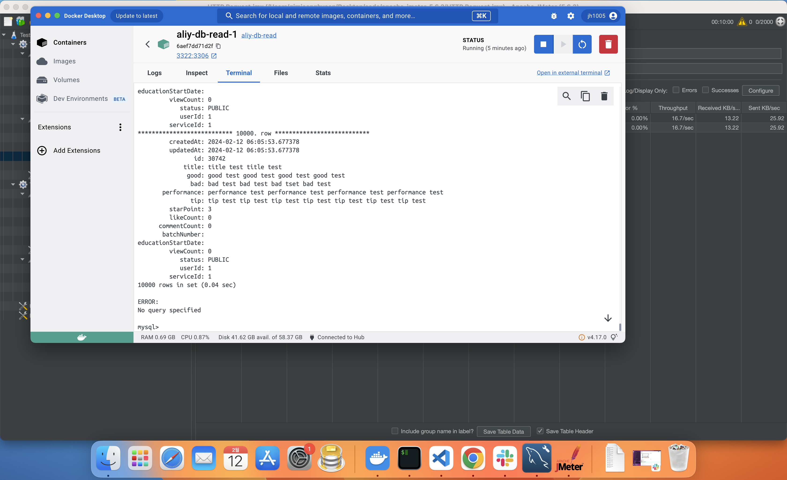

aliy 서비스는 리뷰가 메인이다. 리뷰라는 것의 특성상 쓰기보다는 읽기요청이 많을 것이라는게 예상되었고, 사용자가 많아졌을 때 적용할 수 있는 cqrs패턴을 사용해 데이터베이스를 분리했을 때와 분리하지 않았을 때의 성능차이를 보기위해 테스트를 진행하게 되었다.

### jmeter

원래는 ngrinder를 활용해 테스트를 진행하려고 했었으나 jmeter로 테스트를 하게 되었다.
ngrinder는 docker를 활용해 agent를 늘리며, 배포환경에서 테스트가 가능했으나 비용적인 문제로 배포환경에서의 테스트는 할 수가 없었다. 물론 ngrinder도 로컬환경에서 테스트가 가능하지만 기기 성능 이슈로 docker를 많이 띄울 수 없어 mysql의 master, slave 세팅만 가져가며 jmeter를 선택하게 되었다.

### 테스트

aliy 서비스에서 가장 많이 일어날 수 있는 일은 리뷰 등록과 리스트 요청이었다. 그래서 이 두가지를 메인으로 테스트를 진행하게 되었다. 두개의 쓰레드그룹을 만들어 하나는 1분에 걸쳐 1000명의 사용자가 로그인을 한 후 10번씩 리뷰를 등록하는 시나리오를 다른 하나는 1분에 걸쳐 1000명의 사용자가 로그인을 한 후 리스트 요청을 하는 시나리오로 진행했다.

### 데이터베이스 분리 전

위는 분리하기 전의 결과이다. 분리하기 전의 등록요청은 총 1만개의 실행이 평균 응답시간은 26초로 99%를 처리하는데 있어 43초가 걸린다고 나왔다. 그러나 표준편차가 큰 것을 확인할 수 있었다.
리스트 요청은 등록요청보다는 적은 수치가 나왔다. 총 1만개의 실행이 평균 응답시간 21초로 99%를 처리하는데 있어 30초가 걸리며 표준편차 또한 등록요청보다 낮게 나온 것을 확인할 수 있었다.

### 데이터베이스 분리 후

분리 했을 때의 결과이다. 전체적으로 분리하기 전보다 훨씬 좋은 것을 확인할 수 있다. 우선 등록요청에서 표준편차 또한 굉장히 줄어들었고, 평균 응답시간도 많이 줄어들었다.
리스트 요청 또한 등록요청과 같이 확연한 차이를 확인해 볼 수 있었다.

위는 테스트 후 데이터베이스를 확인한 결과이다. master db에서와 slave db에서의 테이블 데이터의 차이는 단일로 테스트를 우선 진행하며 쌓은 데이터가 추가로 있기 때문이다.

### 마무리

처음 jmeter를 사용할 때는 단순한 작업도 어려움이 많았다. 토큰을 설정하는 과정이며 요청을 순서대로 할 때의 작업 등등 어려운게 많았지만 이번 테스트를 진행하며 연습이 많이 되었다.
더 다양하게 테스트를 해보고, 더 많은 요청에 대한 테스트도 해봐야겠다.
